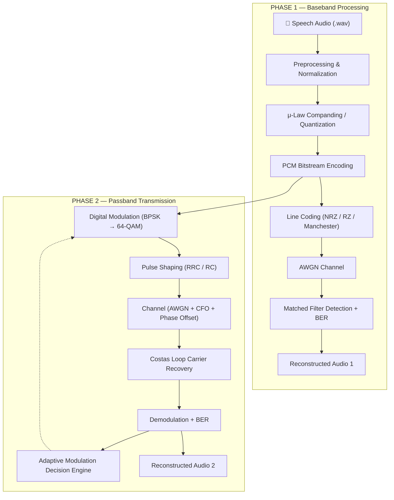

# 📡 Digital Communications Baseband & Passband System

<p align="center">
  <b>An end-to-end Python simulation of a full digital communication chain</b><br>
  Source coding → Line coding → Passband modulation → Pulse shaping → Carrier recovery → Adaptive modulation → Voice reconstruction
</p>

<p align="center">
  <a href="https://www.python.org/"></a>
  <a href="LICENSE"></a>
  <a href="https://numpy.org/"></a>
  <a href="https://scipy.org/"></a>
  <a href="https://matplotlib.org/"></a>
  
</p>

<p align="center">
  <a href="#-overview">Overview</a> •
  <a href="#-key-features">Features</a> •
  <a href="#-system-architecture">Architecture</a> •
  <a href="#-mathematical-formulation">Math</a> •
  <a href="#-experimental-results--benchmarks">Results</a> •
  <a href="#-installation--usage">Usage</a> •
  <a href="#-roadmap">Roadmap</a>
</p>

---

## 📌 Overview

This repository provides an end-to-end simulation framework for digital communication systems, split into two complementary phases:

| Phase | Focus | Core techniques |
|---|---|---|
| **Phase 1 — Baseband** | Speech acquisition → PCM → line coding → AWGN → detection | μ-Law companding, Polar NRZ/RZ, Manchester, matched filtering |
| **Phase 2 — Passband** | RF-style transmission of the Phase-1 bitstream | BPSK/QPSK/16-QAM/64-QAM, RRC pulse shaping, Costas loop, adaptive modulation |

The two phases are designed to be run as a **single pipeline**: Phase 1 produces a PCM bitstream from real (or synthetic) speech audio, and Phase 2 consumes that bitstream, transmits it over an impaired passband channel, and reconstructs the original voice signal at the receiver — closing the loop from *sound in* to *sound out*.

---

## ✨ Key Features

### 🎤 Phase 1 — Baseband System
- **Speech acquisition** — 16 kHz mono WAV ingestion, with automatic fallback to a synthetic multitone test vector when no file is supplied.
- **Non-uniform quantization** — Uniform PCM (2/4/8-bit) benchmarked against μ-Law companding (μ = 255) using SQNR and MSE.
- **Line coding** — Natural binary PCM mapped to Polar NRZ, Polar RZ, and Manchester.
- **Spectral analysis** — PSD estimation and main-lobe bandwidth comparison across line codes.
- **Performance benchmarking** — Empirical BER vs. $E_b/N_0$ validated against the theoretical Q-function curve.

### 📶 Phase 2 — Passband & Adaptive Modulation
- **Digital modulation** — Gray-coded BPSK, QPSK, 16-QAM, and 64-QAM constellations.
- **Pulse shaping** — Rectangular, Raised Cosine (RC), and Root-Raised Cosine (RRC) filters for ISI mitigation.
- **Channel impairments** — AWGN combined with carrier frequency offset (CFO) and phase noise.
- **Carrier recovery** — Pilot-aided PLL / Costas loop for phase and frequency synchronization.
- **Adaptive Modulation (AMS)** — SNR-driven scheme switching (BPSK → QPSK → 16-QAM → 64-QAM) to maximize spectral efficiency.
- **Diagnostics** — Automated constellation diagrams, eye diagrams, BER-vs-SNR curves, and throughput plots.

---

## 🔄 System Architecture



> GitHub renders Mermaid diagrams natively — no extra image needed. If you prefer a static image, export this block via the [Mermaid Live Editor](https://mermaid.live) and drop it in `Figures/`.

---

## 📐 Mathematical Formulation

### 1. μ-Law Companding
To maximize SQNR for speech signals with high crest factors, non-uniform quantization follows the logarithmic compressor profile:

$$y = \text{sgn}(x)\,\frac{\ln(1 + \mu |x|)}{\ln(1 + \mu)}, \qquad \mu = 255,\quad |x| \le 1$$

### 2. Theoretical BER — Polar NRZ (AWGN)

$$P_e = Q\left(\sqrt{\frac{2E_b}{N_0}}\right)$$

### 3. Theoretical Symbol Error Rate — M-ary QAM

$$P_s \approx 4\left(1 - \frac{1}{\sqrt{M}}\right) Q\left(\sqrt{\frac{3\,\text{SNR}_{avg}}{M-1}}\right)$$

### 4. Root-Raised Cosine Pulse Shape

$$h_{RRC}(t) = \frac{1}{\sqrt{T}}\cdot\frac{\sin\!\left(\pi\frac{t}{T}(1-\beta)\right) + 4\beta\frac{t}{T}\cos\!\left(\pi\frac{t}{T}(1+\beta)\right)}{\pi\frac{t}{T}\left[1-\left(4\beta\frac{t}{T}\right)^2\right]}$$

where $\beta$ is the roll-off factor. *(Update with the exact $\beta$ used in `phase2.py` — see note below.)*

> 📝 **Note:** the roll-off factor and the SNR thresholds used in the adaptive modulation state machine are implementation details living in `phase2.py`. Pull the exact values from your code / `log_report.txt` and drop them into a short table here, e.g.:
>
> | Modulation | Min. SNR threshold (dB) | Spectral efficiency (bits/symbol) |
> |---|---|---|
> | BPSK | — | 1 |
> | QPSK | — | 2 |
> | 16-QAM | — | 4 |
> | 64-QAM | — | 6 |

---

## 📊 Experimental Results & Benchmarks

### Phase 1 — Quantization Performance (11.63 s audio @ 16 kHz)

| Configuration | Bit Depth | Total Bits | SQNR (dB) | MSE |
|---|:---:|:---:|:---:|:---:|
| Uniform Quantizer | 8-bit | 1,488,216 | 32.15 dB | $6.09 \times 10^{-4}$ |
| **μ-Law Compander (μ=255)** | **8-bit** | **1,488,216** | **37.81 dB** | **$1.65 \times 10^{-4}$** |

> **Key result:** μ-law companding yields a **~5.66 dB SQNR improvement** over uniform quantization for speech. Empirical BER tracks the theoretical Q-function curve within ±1 dB across $E_b/N_0 \in [0, 10]$ dB.

### Phase 2 — Carrier Recovery & Adaptive Modulation

- **Without carrier recovery:** residual CFO causes constellation rotation and a hard error floor near BER ≈ 0.5.
- **With pilot-aided Costas loop synchronization:** phase/frequency lock is restored and BER returns to theoretical limits.
- **Adaptive modulation:** the scheme switches constellation density at SNR-dependent thresholds, trading power efficiency for throughput as channel quality improves.

*(Add your actual BER-vs-SNR table or plot from `results_phase2/` here — a side-by-side "with recovery / without recovery" figure is the single most convincing piece of evidence in this repo.)*

---

## 📁 Repository Structure

```
Digital-Communications-Baseband-System/
├── Figures/            # Phase 1 plots (BER curves, PSD, histograms)
├── results_phase2/     # Phase 2 plots (constellations, eye diagrams, throughput)
├── main.py             # Phase 1 entry point — baseband pipeline
├── phase2.py           # Phase 2 entry point — passband pipeline
├── log_report.txt      # Automated execution metrics & SQNR logs
├── requirements.txt    # Python dependencies
├── README.md           # Documentation
└── LICENSE             # MIT License
```

---

## 🚀 Installation & Usage

### 1. Clone & install dependencies
```bash
git clone https://github.com/Armin-Il/Digital-Communications-Baseband-System.git
cd Digital-Communications-Baseband-System
pip install -r requirements.txt
```

### 2. Run the baseband pipeline (Phase 1)
```bash
python main.py path/to/your_speech.wav
```
If no WAV file is supplied, a synthetic multitone test vector is generated automatically.

### 3. Run the passband pipeline (Phase 2)
```bash
python phase2.py
```

---

## 🔮 Roadmap

Ideas for future exploration — not committed deliverables:

- [ ] **Forward Error Correction** — Convolutional and LDPC channel coding
- [ ] **Fading channels** — Multipath Rayleigh and Rician models
- [ ] **Multi-carrier extension** — OFDM with cyclic prefix
- [ ] **Symbol timing recovery** — Gardner or Mueller–Müller algorithms

---

## 👨‍💻 Author

**Armin Ilat**
Undergraduate Electrical Engineering Student — Shahid Beheshti University (SBU)

<!-- Add your contact links, e.g.: -->
<!-- [](your-linkedin-url) -->
<!-- [](mailto:your-email) -->

## 📄 License

This project is licensed under the [MIT License](LICENSE).
